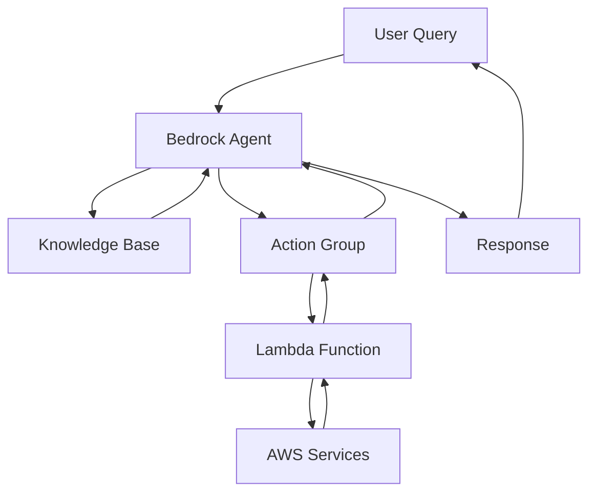

# AWS Bedrock Agents: Building Production-Ready AI Assistants

AWS Bedrock Agents provide a powerful platform for building enterprise-grade AI assistants that can integrate with your existing AWS infrastructure. Unlike traditional chatbots, Bedrock Agents can perform complex actions, access knowledge bases, and maintain context across conversations.

## What are AWS Bedrock Agents?

AWS Bedrock Agents are AI-powered assistants that can:

- **Execute Actions**: Perform specific tasks using AWS services
- **Access Knowledge Bases**: Query enterprise data sources
- **Maintain Context**: Remember conversation history
- **Integrate with AWS Services**: Native integration with Lambda, S3, RDS, etc.
- **Scale Automatically**: Handle varying workloads without manual intervention

## Architecture Overview



## Setting Up Your First Agent

### 1. Prerequisites

```bash
# Install AWS CLI and configure
aws configure

# Install AWS SDK for Python
pip install boto3

# Verify Bedrock access
aws bedrock list-foundation-models
```

### 2. Create a Knowledge Base

```python
import boto3
import json
from botocore.exceptions import ClientError

class BedrockKnowledgeBase:
    def __init__(self):
        self.bedrock_client = boto3.client('bedrock-agent')
        self.bedrock_runtime = boto3.client('bedrock-agent-runtime')
    
    def create_knowledge_base(self, kb_name: str, description: str):
        """Create a new knowledge base."""
        try:
            response = self.bedrock_client.create_knowledge_base(
                name=kb_name,
                description=description,
                roleArn='arn:aws:iam::ACCOUNT:role/BedrockKnowledgeBaseRole',
                knowledgeBaseConfiguration={
                    'vectorKnowledgeBaseConfiguration': {
                        'embeddingModelArn': 'arn:aws:bedrock:us-east-1::foundation-model/amazon.titan-embed-text-v1'
                    }
                },
                storageConfiguration={
                    'type': 'OPENSEARCH_SERVERLESS',
                    'opensearchServerlessConfiguration': {
                        'collectionArn': 'arn:aws:aoss:us-east-1:ACCOUNT:collection/your-collection',
                        'vectorIndexName': 'bedrock-knowledge-base-index',
                        'fieldMapping': {
                            'vectorField': 'bedrock-knowledge-base-default-vector',
                            'textField': 'AMAZON_BEDROCK_TEXT_CHUNK',
                            'metadataField': 'AMAZON_BEDROCK_METADATA'
                        }
                    }
                }
            )
            return response['knowledgeBase']['knowledgeBaseId']
        except ClientError as e:
            print(f"Error creating knowledge base: {e}")
            return None
    
    def add_data_source(self, kb_id: str, data_source_name: str, s3_bucket: str):
        """Add an S3 data source to the knowledge base."""
        try:
            response = self.bedrock_client.create_data_source(
                knowledgeBaseId=kb_id,
                name=data_source_name,
                description=f"Data source for {data_source_name}",
                dataSourceConfiguration={
                    'type': 'S3',
                    's3Configuration': {
                        'bucketArn': f'arn:aws:s3:::{s3_bucket}',
                        'inclusionPrefixes': ['documents/'],
                        'exclusionPrefixes': ['temp/']
                    }
                },
                vectorIngestionConfiguration={
                    'chunkingConfiguration': {
                        'chunkingStrategy': 'FIXED_SIZE',
                        'fixedSizeChunkingConfiguration': {
                            'maxTokens': 300,
                            'overlapPercentage': 20
                        }
                    }
                }
            )
            return response['dataSource']['dataSourceId']
        except ClientError as e:
            print(f"Error creating data source: {e}")
            return None
```

### 3. Create an Agent

```python

class BedrockAgent:
    def __init__(self):
        self.bedrock_client = boto3.client('bedrock-agent')
        self.bedrock_runtime = boto3.client('bedrock-agent-runtime')
    
    def create_agent(self, agent_name: str, description: str, kb_id: str):
        """Create a new Bedrock agent."""
        try:
            response = self.bedrock_client.create_agent(
                agentName=agent_name,
                description=description,
                foundationModel='arn:aws:bedrock:us-east-1::foundation-model/anthropic.claude-3-sonnet-20240229-v1:0',
                instruction='You are a helpful AI assistant that can answer questions and perform tasks.',
                agentResourceRoleArn='arn:aws:iam::ACCOUNT:role/BedrockAgentRole',
                knowledgeBaseConfiguration={
                    'type': 'VECTOR',
                    'vectorKnowledgeBaseConfiguration': {
                        'knowledgeBaseId': kb_id,
                        'modelArn': 'arn:aws:bedrock:us-east-1::foundation-model/amazon.titan-embed-text-v1'
                    }
                }
            )
            return response['agent']['agentId']
        except ClientError as e:
            print(f"Error creating agent: {e}")
            return None
    
    def create_action_group(self, agent_id: str, action_group_name: str, lambda_arn: str):
        """Create an action group for the agent."""
        try:
            response = self.bedrock_client.create_agent_action_group(
                agentId=agent_id,
                actionGroupName=action_group_name,
                description=f"Action group for {action_group_name}",
                parentActionGroupSignature='AMAZON.UserInput',
                actionGroupExecutor={
                    'lambda': lambda_arn
                },
                apiSchema={
                    'payload': json.dumps({
                        'openapi': '3.0.0',
                        'info': {
                            'title': 'Customer Service API',
                            'version': '1.0.0'
                        },
                        'paths': {
                            '/get-order-status': {
                                'get': {
                                    'summary': 'Get order status',
                                    'parameters': [
                                        {
                                            'name': 'orderId',
                                            'in': 'query',
                                            'required': True,
                                            'schema': {'type': 'string'}
                                        }
                                    ],
                                    'responses': {
                                        '200': {
                                            'description': 'Order status',
                                            'content': {
                                                'application/json': {
                                                    'schema': {
                                                        'type': 'object',
                                                        'properties': {
                                                            'status': {'type': 'string'},
                                                            'trackingNumber': {'type': 'string'}
                                                        }
                                                    }
                                                }
                                            }
                                        }
                                    }
                                }
                            }
                        }
                    })
                }
            )
            return response['agentActionGroup']['actionGroupId']
        except ClientError as e:
            print(f"Error creating action group: {e}")
            return None
```

## Lambda Function Implementation

### Customer Service Action Handler

```python
import json
import boto3
from datetime import datetime

def lambda_handler(event, context):
    """Lambda function to handle Bedrock agent actions."""
    
    try:
        # Parse the event from Bedrock Agent
        action_group = event['actionGroup']
        api_path = event['apiPath']
        parameters = event.get('parameters', [])
        
        # Route to appropriate handler
        if api_path == '/get-order-status':
            return handle_get_order_status(parameters)
        elif api_path == '/process-refund':
            return handle_process_refund(parameters)
        elif api_path == '/escalate-ticket':
            return handle_escalate_ticket(parameters)
        else:
            return {
                'statusCode': 404,
                'body': json.dumps({'error': 'API path not found'})
            }
    
    except Exception as e:
        return {
            'statusCode': 500,
            'body': json.dumps({'error': str(e)})
        }

def handle_get_order_status(parameters):
    """Handle order status lookup."""
    order_id = None
    for param in parameters:
        if param['name'] == 'orderId':
            order_id = param['value']
            break
    
    if not order_id:
        return {
            'statusCode': 400,
            'body': json.dumps({'error': 'Order ID is required'})
        }
    
    # Simulate database lookup
    order_status = lookup_order_status(order_id)
    
    return {
        'statusCode': 200,
        'body': json.dumps({
            'status': order_status['status'],
            'trackingNumber': order_status['tracking_number'],
            'estimatedDelivery': order_status['estimated_delivery'],
            'lastUpdate': order_status['last_update']
        })
    }

def handle_process_refund(parameters):
    """Handle refund processing."""
    order_id = None
    amount = None
    
    for param in parameters:
        if param['name'] == 'orderId':
            order_id = param['value']
        elif param['name'] == 'amount':
            amount = float(param['value'])
    
    if not order_id or not amount:
        return {
            'statusCode': 400,
            'body': json.dumps({'error': 'Order ID and amount are required'})
        }
    
    # Process refund
    refund_id = process_refund_request(order_id, amount)
    
    return {
        'statusCode': 200,
        'body': json.dumps({
            'refundId': refund_id,
            'status': 'processed',
            'amount': amount,
            'estimatedProcessingTime': '3-5 business days'
        })
    }

def lookup_order_status(order_id):
    """Simulate order status lookup."""
    # In production, this would query your database
    return {
        'status': 'shipped',
        'tracking_number': 'TRK123456789',
        'estimated_delivery': '2024-02-15',
        'last_update': '2024-02-10T10:30:00Z'
    }

def process_refund_request(order_id, amount):
    """Simulate refund processing."""
    # In production, this would integrate with your payment system
    return f"REF-{order_id}-{int(datetime.now().timestamp())}"
```

## Advanced Agent Configuration

### Multi-Model Agent

```python
class MultiModelAgent:
    def __init__(self):
        self.bedrock_client = boto3.client('bedrock-agent')
    
    def create_multi_model_agent(self, agent_name: str):
        """Create an agent that can use multiple models."""
        
        # Define different models for different tasks
        model_configurations = {
            'general_chat': 'arn:aws:bedrock:us-east-1::foundation-model/anthropic.claude-3-sonnet-20240229-v1:0',
            'code_generation': 'arn:aws:bedrock:us-east-1::foundation-model/anthropic.claude-3-sonnet-20240229-v1:0',
            'data_analysis': 'arn:aws:bedrock:us-east-1::foundation-model/anthropic.claude-3-sonnet-20240229-v1:0'
        }
        
        # Create agent with dynamic model selection
        response = self.bedrock_client.create_agent(
            agentName=agent_name,
            description="Multi-model agent for different task types",
            foundationModel=model_configurations['general_chat'],
            instruction="""
            You are a versatile AI assistant that can handle different types of tasks.
            Based on the user's request, select the most appropriate model:
            - For general conversation: Use Claude Sonnet
            - For code generation: Use Claude Sonnet with code-focused instructions
            - For data analysis: Use Claude Sonnet with analytical focus
            """,
            agentResourceRoleArn='arn:aws:iam::ACCOUNT:role/BedrockAgentRole'
        )
        
        return response['agent']['agentId']
```

### Custom Guardrails

```python
class AgentGuardrails:
    def __init__(self):
        self.bedrock_client = boto3.client('bedrock-agent')
    
    def create_guardrails(self, agent_id: str):
        """Create custom guardrails for the agent."""
        
        guardrails_config = {
            'contentFilters': [
                {
                    'type': 'HATE',
                    'inputStrength': 'HIGH',
                    'outputStrength': 'HIGH'
                },
                {
                    'type': 'INSULTS',
                    'inputStrength': 'HIGH',
                    'outputStrength': 'HIGH'
                },
                {
                    'type': 'MISCONDUCT',
                    'inputStrength': 'HIGH',
                    'outputStrength': 'HIGH'
                },
                {
                    'type': 'PROMPT_ATTACK',
                    'inputStrength': 'HIGH',
                    'outputStrength': 'HIGH'
                }
            ],
            'wordPolicy': {
                'words': ['confidential', 'internal', 'proprietary'],
                'action': 'BLOCK'
            },
            'topicPolicy': {
                'topics': [
                    {
                        'name': 'Financial Information',
                        'definition': 'Discussions about company financials, revenue, or sensitive business metrics',
                        'action': 'BLOCK'
                    }
                ]
            }
        }
        
        # Apply guardrails to agent
        response = self.bedrock_client.update_agent(
            agentId=agent_id,
            guardrailConfiguration=guardrails_config
        )
        
        return response
```

## Production Deployment

### Infrastructure as Code

```yaml
# cloudformation-template.yaml
AWSTemplateFormatVersion: '2010-09-09'
Description: 'Bedrock Agent Infrastructure'

Resources:
  BedrockAgentRole:
    Type: AWS::IAM::Role
    Properties:
      RoleName: BedrockAgentRole
      AssumeRolePolicyDocument:
        Version: '2012-10-17'
        Statement:
          - Effect: Allow
            Principal:
              Service: bedrock.amazonaws.com
            Action: sts:AssumeRole
      Policies:
        - PolicyName: BedrockAgentPolicy
          PolicyDocument:
            Version: '2012-10-17'
            Statement:
              - Effect: Allow
                Action:
                  - bedrock:InvokeModel
                  - bedrock:InvokeModelWithResponseStream
                Resource: '*'
              - Effect: Allow
                Action:
                  - s3:GetObject
                  - s3:ListBucket
                Resource: '*'
              - Effect: Allow
                Action:
                  - lambda:InvokeFunction
                Resource: !GetAtt AgentLambdaFunction.Arn

  AgentLambdaFunction:
    Type: AWS::Lambda::Function
    Properties:
      FunctionName: BedrockAgentHandler
      Runtime: python3.9
      Handler: index.lambda_handler
      Code:
        ZipFile: |
          # Lambda function code here
      Role: !GetAtt LambdaExecutionRole.Arn
      Environment:
        Variables:
          KNOWLEDGE_BASE_ID: !Ref KnowledgeBase
          AGENT_ID: !Ref BedrockAgent

  LambdaExecutionRole:
    Type: AWS::IAM::Role
    Properties:
      AssumeRolePolicyDocument:
        Version: '2012-10-17'
        Statement:
          - Effect: Allow
            Principal:
              Service: lambda.amazonaws.com
            Action: sts:AssumeRole
      ManagedPolicyArns:
        - arn:aws:iam::aws:policy/service-role/AWSLambdaBasicExecutionRole
      Policies:
        - PolicyName: LambdaPolicy
          PolicyDocument:
            Version: '2012-10-17'
            Statement:
              - Effect: Allow
                Action:
                  - bedrock:InvokeModel
                  - s3:GetObject
                  - s3:PutObject
                  - dynamodb:GetItem
                  - dynamodb:PutItem
                  - dynamodb:Query
                Resource: '*'

  KnowledgeBase:
    Type: AWS::Bedrock::KnowledgeBase
    Properties:
      Name: CustomerServiceKB
      Description: Knowledge base for customer service
      RoleArn: !GetAtt KnowledgeBaseRole.Arn
      KnowledgeBaseConfiguration:
        VectorKnowledgeBaseConfiguration:
          EmbeddingModelArn: arn:aws:bedrock:us-east-1::foundation-model/amazon.titan-embed-text-v1
      StorageConfiguration:
        Type: OPENSEARCH_SERVERLESS
        OpensearchServerlessConfiguration:
          CollectionArn: !Ref OpenSearchCollection
          VectorIndexName: customer-service-index
          FieldMapping:
            VectorField: bedrock-knowledge-base-default-vector
            TextField: AMAZON_BEDROCK_TEXT_CHUNK
            MetadataField: AMAZON_BEDROCK_METADATA

  BedrockAgent:
    Type: AWS::Bedrock::Agent
    Properties:
      AgentName: CustomerServiceAgent
      Description: AI agent for customer service
      FoundationModel: arn:aws:bedrock:us-east-1::foundation-model/anthropic.claude-3-sonnet-20240229-v1:0
      Instruction: |
        You are a helpful customer service AI assistant. You can:
        1. Look up order status
        2. Process refunds
        3. Answer questions about products and services
        4. Escalate complex issues to human agents
        
        Always be polite, helpful, and accurate in your responses.
      AgentResourceRoleArn: !GetAtt BedrockAgentRole.Arn
      KnowledgeBaseConfiguration:
        Type: VECTOR
        VectorKnowledgeBaseConfiguration:
          KnowledgeBaseId: !Ref KnowledgeBase
          ModelArn: arn:aws:bedrock:us-east-1::foundation-model/amazon.titan-embed-text-v1
```

### Monitoring and Analytics

```python
import boto3
import json
from datetime import datetime, timedelta

class AgentMonitoring:
    def __init__(self):
        self.cloudwatch = boto3.client('cloudwatch')
        self.bedrock_runtime = boto3.client('bedrock-agent-runtime')
    
    def create_custom_metrics(self, agent_id: str):
        """Create custom CloudWatch metrics for agent monitoring."""
        
        metrics = [
            {
                'MetricName': 'AgentInvocations',
                'Namespace': 'BedrockAgent/Custom',
                'Dimensions': [
                    {'Name': 'AgentId', 'Value': agent_id}
                ]
            },
            {
                'MetricName': 'ResponseTime',
                'Namespace': 'BedrockAgent/Custom',
                'Dimensions': [
                    {'Name': 'AgentId', 'Value': agent_id}
                ]
            },
            {
                'MetricName': 'ErrorRate',
                'Namespace': 'BedrockAgent/Custom',
                'Dimensions': [
                    {'Name': 'AgentId', 'Value': agent_id}
                ]
            }
        ]
        
        return metrics
    
    def log_agent_interaction(self, agent_id: str, user_id: str, query: str, response: str, response_time: float):
        """Log agent interactions for analytics."""
        
        # Send custom metrics
        self.cloudwatch.put_metric_data(
            Namespace='BedrockAgent/Custom',
            MetricData=[
                {
                    'MetricName': 'AgentInvocations',
                    'Dimensions': [
                        {'Name': 'AgentId', 'Value': agent_id},
                        {'Name': 'UserId', 'Value': user_id}
                    ],
                    'Value': 1,
                    'Unit': 'Count',
                    'Timestamp': datetime.utcnow()
                },
                {
                    'MetricName': 'ResponseTime',
                    'Dimensions': [
                        {'Name': 'AgentId', 'Value': agent_id}
                    ],
                    'Value': response_time,
                    'Unit': 'Seconds',
                    'Timestamp': datetime.utcnow()
                }
            ]
        )
        
        # Log to CloudWatch Logs
        log_data = {
            'timestamp': datetime.utcnow().isoformat(),
            'agent_id': agent_id,
            'user_id': user_id,
            'query': query,
            'response': response,
            'response_time': response_time
        }
        
        print(json.dumps(log_data))
    
    def get_agent_analytics(self, agent_id: str, days: int = 7):
        """Get analytics data for the agent."""
        
        end_time = datetime.utcnow()
        start_time = end_time - timedelta(days=days)
        
        # Get invocation count
        invocations = self.cloudwatch.get_metric_statistics(
            Namespace='BedrockAgent/Custom',
            MetricName='AgentInvocations',
            Dimensions=[{'Name': 'AgentId', 'Value': agent_id}],
            StartTime=start_time,
            EndTime=end_time,
            Period=3600,  # 1 hour
            Statistics=['Sum']
        )
        
        # Get average response time
        response_times = self.cloudwatch.get_metric_statistics(
            Namespace='BedrockAgent/Custom',
            MetricName='ResponseTime',
            Dimensions=[{'Name': 'AgentId', 'Value': agent_id}],
            StartTime=start_time,
            EndTime=end_time,
            Period=3600,
            Statistics=['Average']
        )
        
        return {
            'total_invocations': sum(point['Sum'] for point in invocations['Datapoints']),
            'average_response_time': sum(point['Average'] for point in response_times['Datapoints']) / len(response_times['Datapoints']) if response_times['Datapoints'] else 0
        }
```

## Best Practices

### 1. Security

```python
class SecureAgent:
    def __init__(self):
        self.bedrock_client = boto3.client('bedrock-agent')
    
    def create_secure_agent(self, agent_name: str):
        """Create an agent with security best practices."""
        
        # Define security policies
        security_config = {
            'dataEncryption': {
                'kmsKeyId': 'arn:aws:kms:us-east-1:ACCOUNT:key/your-key-id'
            },
            'networkSecurity': {
                'vpcConfiguration': {
                    'subnetIds': ['subnet-12345', 'subnet-67890'],
                    'securityGroupIds': ['sg-12345']
                }
            },
            'accessControl': {
                'iamPolicy': {
                    'Version': '2012-10-17',
                    'Statement': [
                        {
                            'Effect': 'Allow',
                            'Action': [
                                'bedrock:InvokeModel'
                            ],
                            'Resource': 'arn:aws:bedrock:us-east-1::foundation-model/anthropic.claude-3-sonnet-20240229-v1:0',
                            'Condition': {
                                'StringEquals': {
                                    'aws:RequestedRegion': 'us-east-1'
                                }
                            }
                        }
                    ]
                }
            }
        }
        
        return security_config
```

### 2. Performance Optimization

```python
class OptimizedAgent:
    def __init__(self):
        self.bedrock_runtime = boto3.client('bedrock-agent-runtime')
    
    def optimize_agent_performance(self, agent_id: str, session_id: str):
        """Optimize agent performance with caching and streaming."""
        
        # Use streaming for better user experience
        response = self.bedrock_runtime.invoke_agent(
            agentId=agent_id,
            sessionId=session_id,
            inputText="What is the status of order ORD-123?",
            enableTrace=True,
            endSession=False
        )
        
        # Process streaming response
        for event in response['completion']:
            if 'chunk' in event:
                chunk = event['chunk']
                if 'bytes' in chunk:
                    print(chunk['bytes'].decode('utf-8'), end='')
        
        return response
```

## Conclusion

AWS Bedrock Agents provide a robust platform for building production-ready AI assistants that can integrate seamlessly with your existing AWS infrastructure. Key benefits include:

- **Enterprise Integration**: Native AWS service integration
- **Scalability**: Automatic scaling based on demand
- **Security**: Built-in security and compliance features
- **Monitoring**: Comprehensive monitoring and analytics
- **Cost Efficiency**: Pay-per-use pricing model

By following the patterns and best practices outlined in this guide, you can build sophisticated AI agents that enhance your customer service capabilities and automate complex business processes.

---

*Have you built any agents with AWS Bedrock? Share your experiences and lessons learned in the comments below.*

