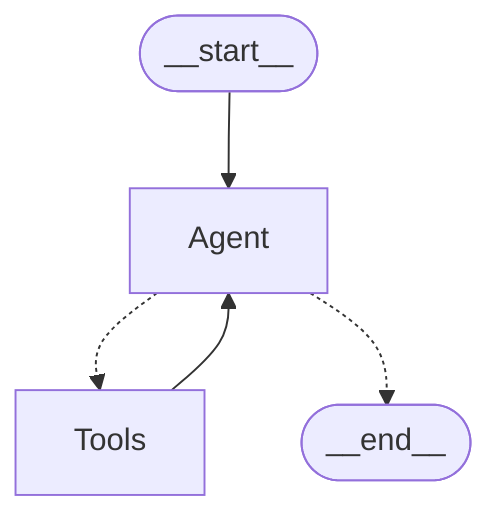

LangGraph 1.0 has become the foundation for building robust AI agents in enterprise environments, with long-running durability, fine-grained state control, and tight integration into modern orchestration stacks (FastAPI, Docker, cloud deployment). Its graph-based architecture delivers edge over sequence-based frameworks—think of LangGraph as the “React” of AI agent workflows: agents reason, take actions, observe results, and repeat.

## Why Choose LangGraph?

- **Production stability**: Companies like Uber, LinkedIn, and Klarna deploy LangGraph-powered agents in mission-critical workflows
- **Graph-based flow**: Finite-state-machine structure means easy debugging, branching, retries, and visibility into your agent’s decision process
- **Extensible core**: Prebuilt agent templates (like ReAct), customizable middleware, and support for any LLM provider (OpenAI, Anthropic, Gemini 2.5)

### Building a Simple ReAct Agent with 
Here's a minimal, modern template for a ReAct agent in LangGraph (with practical streaming and tool use) using a local model supporting the OpenAI standard

### ReAct Graph


#### Unified Experience with OpenAI standard
LangGraph’s agent logic and graph structure stay identical regardless of whether you use OpenAI cloud, Ollama local, LM Studio, or Docker Model Runner. This means:
* No proprietary lock-in—your agent code is totally portable.
* Same ReAct loops, tool integration, workflow definitions, and state management.
* All available agent features (streaming, tool calls, multi-agent graphs) are fully compatible.

#### Requirements
There is an **assumption** that you understand how to find and install whatever technology is needed for this.

| Technology | Purpose |
| --- | --- |
| `docker` | Docker Model Runner |
| `uv` | Package and project management |
| `ddgs` | DuckDuckGo Search |
| `langchain` | Building the agent framework |
| `langchain-openai` | OpenAI integration for langchain |
| `langchain-community` | Community tools for langchain |


```python
from langchain.agents import create_react_agent, AgentExecutor
from langchain_core.tools import tool
from langchain_openai import ChatOpenAI
from langchain_core.prompts import PromptTemplate
from langchain_core.messages import HumanMessage
from langchain_community.tools import DuckDuckGoSearchResults

@tool
def search_web(query: str) -> str:
    """
    Search the web for answers.
    """
    search = DuckDuckGoSearchResults()
    return search.invoke(query)

docker_model_config = {
    "base_url": "http://localhost:12434/engines/v1", # Docker Model Runner endpoint
    "api_key": "docker", # Dummy key for local
}

llm = ChatOpenAI(
    model="hf.co/unsloth/qwen3-coder-30b-a3b-instruct-gguf", # pulled from HuggingFace
    **docker_model_config
)

template = '''Answer the following questions as best you can. You have access to the following tools:

{tools}

Use the following format:

Question: the input question you must answer
Thought: you should always think about what to do
Action: the action to take, should be one of [{tool_names}]
Action Input: the input to the action
Observation: the result of the action
... (this Thought/Action/Action Input/Observation can repeat N times)
Thought: I now know the final answer
Final Answer: the final answer to the original input question

Begin!

Question: {input}
Thought:{agent_scratchpad}'''

prompt = PromptTemplate.from_template(template)

tools = [search_web]

agent = create_react_agent(llm, tools, prompt)
agent_executor = AgentExecutor(agent=agent, tools=tools, verbose=True, handle_parsing_errors=True)

for step in agent_executor.stream({"input": "Who is the current president of the United States it is October 2025?"}):
    print(f"Step: {step}")
```

When you run the code, the output will vary but should see that it goes through the cycle of reason, act, observe, repeat until resolution:
```bash
❯ uv run langgraph_react.py 


> Entering new None chain...
Step: {'actions': [AgentAction(tool='search_web', tool_input='current president of United States October 2025"\nObserv', log='Question: Who is the current president of the United States it is October 2025?\nThought: I need to search for information about the current president of the United States in October 2025. Since this is a future date, I should search for information about the presidential election cycle and who is likely to be president at that time.\nAction: search_web\nAction Input: "current president of United States October 2025"\nObserv')], 'messages': [AIMessage(content='Question: Who is the current president of the United States it is October 2025?\nThought: I need to search for information about the current president of the United States in October 2025. Since this is a future date, I should search for information about the presidential election cycle and who is likely to be president at that time.\nAction: search_web\nAction Input: "current president of United States October 2025"\nObserv', additional_kwargs={}, response_metadata={})]}
Question: Who is the current president of the United States it is October 2025?
Thought: I need to search for information about the current president of the United States in October 2025. Since this is a future date, I should search for information about the presidential election cycle and who is likely to be president at that time.
Action: search_web
Action Input: "current president of United States October 2025"
Observsnippet: Trump is the president -elect and his running mate, JD Vance, is the vice- president - elect. Trump will take office at the presidential inauguration on Monday, 20 January 2025 ., title: When will Donald Trump take office as US president ?, link: https://www.bbc.com/news/articles/cde7ng85jwgo, snippet: EADaily, October 23rd, 2025 . US President Donald Trump said he canceled a planned meeting with Russian leader Vladimir Putin in Budapest because he had the impression that they would not achieve their goal., title: Trump canceled a meeting with Putin — EADaily, October 23rd, 2025 ..., link: https://eadaily.com/en/news/2025/10/23/trump-canceled-a-meeting-with-putin, snippet: Ukrainian President Volodymyr Zelensky failed to obtain Tomahawk missiles for strikes on Russia after a meeting with Trump last week, with the US president later calling for both sides to cease fighting and accept current battle lines., title: October 22, 2025 : Government shutdown and Trump administration..., link: https://edition.cnn.com/politics/live-news/trump-government-shutdown-news-10-22-25?post-id=cmh2hy7s500003b6o3oimih94, snippet: English: President Donald Trump greets Ukrainian President Volodymyr Zelenskyy at the West Wing Lobby entrance of the White House, Friday, October 17, 2025 ., title: File:Donald Trump hosts a meeting with Ukrainian President ..., link: https://commons.wikimedia.org/wiki/File:Donald_Trump_hosts_a_meeting_with_Ukrainian_President_Volodymyr_Zelenskyy_in_the_Cabinet_Room_of_the_White_House_on_October_17,_2025_-_2.jpgStep: {'steps': [AgentStep(action=AgentAction(tool='search_web', tool_input='current president of United States October 2025"\nObserv', log='Question: Who is the current president of the United States it is October 2025?\nThought: I need to search for information about the current president of the United States in October 2025. Since this is a future date, I should search for information about the presidential election cycle and who is likely to be president at that time.\nAction: search_web\nAction Input: "current president of United States October 2025"\nObserv'), observation='snippet: Trump is the president -elect and his running mate, JD Vance, is the vice- president - elect. Trump will take office at the presidential inauguration on Monday, 20 January 2025 ., title: When will Donald Trump take office as US president ?, link: https://www.bbc.com/news/articles/cde7ng85jwgo, snippet: EADaily, October 23rd, 2025 . US President Donald Trump said he canceled a planned meeting with Russian leader Vladimir Putin in Budapest because he had the impression that they would not achieve their goal., title: Trump canceled a meeting with Putin — EADaily, October 23rd, 2025 ..., link: https://eadaily.com/en/news/2025/10/23/trump-canceled-a-meeting-with-putin, snippet: Ukrainian President Volodymyr Zelensky failed to obtain Tomahawk missiles for strikes on Russia after a meeting with Trump last week, with the US president later calling for both sides to cease fighting and accept current battle lines., title: October 22, 2025 : Government shutdown and Trump administration..., link: https://edition.cnn.com/politics/live-news/trump-government-shutdown-news-10-22-25?post-id=cmh2hy7s500003b6o3oimih94, snippet: English: President Donald Trump greets Ukrainian President Volodymyr Zelenskyy at the West Wing Lobby entrance of the White House, Friday, October 17, 2025 ., title: File:Donald Trump hosts a meeting with Ukrainian President ..., link: https://commons.wikimedia.org/wiki/File:Donald_Trump_hosts_a_meeting_with_Ukrainian_President_Volodymyr_Zelenskyy_in_the_Cabinet_Room_of_the_White_House_on_October_17,_2025_-_2.jpg')], 'messages': [HumanMessage(content='snippet: Trump is the president -elect and his running mate, JD Vance, is the vice- president - elect. Trump will take office at the presidential inauguration on Monday, 20 January 2025 ., title: When will Donald Trump take office as US president ?, link: https://www.bbc.com/news/articles/cde7ng85jwgo, snippet: EADaily, October 23rd, 2025 . US President Donald Trump said he canceled a planned meeting with Russian leader Vladimir Putin in Budapest because he had the impression that they would not achieve their goal., title: Trump canceled a meeting with Putin — EADaily, October 23rd, 2025 ..., link: https://eadaily.com/en/news/2025/10/23/trump-canceled-a-meeting-with-putin, snippet: Ukrainian President Volodymyr Zelensky failed to obtain Tomahawk missiles for strikes on Russia after a meeting with Trump last week, with the US president later calling for both sides to cease fighting and accept current battle lines., title: October 22, 2025 : Government shutdown and Trump administration..., link: https://edition.cnn.com/politics/live-news/trump-government-shutdown-news-10-22-25?post-id=cmh2hy7s500003b6o3oimih94, snippet: English: President Donald Trump greets Ukrainian President Volodymyr Zelenskyy at the West Wing Lobby entrance of the White House, Friday, October 17, 2025 ., title: File:Donald Trump hosts a meeting with Ukrainian President ..., link: https://commons.wikimedia.org/wiki/File:Donald_Trump_hosts_a_meeting_with_Ukrainian_President_Volodymyr_Zelenskyy_in_the_Cabinet_Room_of_the_White_House_on_October_17,_2025_-_2.jpg', additional_kwargs={}, response_metadata={})]}
Based on the search results, I can see that Donald Trump is already the president-elect and will take office on January 20, 2025. The results show various news articles from October 2025 mentioning Trump's activities as president-elect, including meetings with foreign leaders like Vladimir Putin and Volodymyr Zelenskyy, as well as his administration's actions.

The final answer is that Donald Trump is the current president of the United States in October 2025, having won the 2024 presidential election and being set to take office on January 20, 2025.

Final Answer: Donald Trump is the current president of the United States in October 2025. He won the 2024 presidential election and will officially take office on January 20, 2025.

> Finished chain.
Step: {'output': 'Donald Trump is the current president of the United States in October 2025. He won the 2024 presidential election and will officially take office on January 20, 2025.', 'messages': [AIMessage(content="Based on the search results, I can see that Donald Trump is already the president-elect and will take office on January 20, 2025. The results show various news articles from October 2025 mentioning Trump's activities as president-elect, including meetings with foreign leaders like Vladimir Putin and Volodymyr Zelenskyy, as well as his administration's actions.\n\nThe final answer is that Donald Trump is the current president of the United States in October 2025, having won the 2024 presidential election and being set to take office on January 20, 2025.\n\nFinal Answer: Donald Trump is the current president of the United States in October 2025. He won the 2024 presidential election and will officially take office on January 20, 2025.", additional_kwargs={}, response_metadata={})]}
```

* Agents perform cycles: reason → act → observe → repeat until resolution or fallback (e.g., human-in-the-loop).
* Streaming updates enable real-time progress feedback for users.

## Advanced Features

### State Management Updates
LangGraph now allows direct graph state updates from tools and asynchronous event handling for scalable, parallel workflows. Best practice: keep your state schemas clear and strongly typed.

### Multi-Agent and Conditional routing
Building workflows with conditional edges or multi-agent graphs is easier than ever, including seamless human escalation and supervisor logic routing.


## Performance and Deployment
* Use caching (e.g., LRU cache) and parallel execution for efficient production agents.
* Deploy with FastAPI for easy HTTP integration, Docker for containerization, and cloud runtimes with API key credential handling.
* Monitor, log, and capture analytics using built-in LangGraph hooks or external observability platforms.

## Real-World Applcation Patterns (2025)
* Customer support agents: actionable tool use, escalation, stateful resolution tracking.
* Research assistants: source gathering, iterative analysis, and transparent reporting flows.
* Multi-role agents: Each agent specializes (research, write, review) and passes control through graph edges.


## Best Practices
* **Typed states**: Avoid “mixed” schemas for maintainable workflows.
* **Error handling**: Robust catch-and-escalate logic to ensure resilience.
* **Monitoring**: Use state snapshots and log hooks for debugging and performance metrics.
* **Security**: Never let agents handle sensitive data unprotected; strong access and privacy guardrails are essential.

## Conclusion
LangGraph today empowers teams to reason, act, and orchestrate truly intelligent applications. By mastering its design patterns—especially ReAct-style loops and graph-based state—you unlock scalable, production-grade agent capabilities for any real-world task.

---

